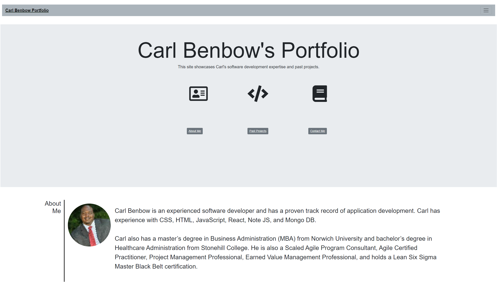

# updated_portfolio
  

## Project Description 
The professional portfolio site showcases Carl Benbow's application development during his time at the Hopkins Bootcamp. Carl's portfolio provides the critical data points that prove he is employer-ready. 

## Table of Content

* [Installation](#installation)

* [Usage](#usage)

* [License](#License)

* [Credits](#Credits)

* [Contribution](#Contribution)

* [Test](#Test)

* [Question](#Question) 

## Installation
There are no specific installation instructions.

Below is the URL to the webpage and github repository. 

Website URL: https://synag.github.io/updated_portfolio/

Github repository: https://github.com/synag/updated_portfolio

## Usage
Minimum usage requirements.

The sreenshot for the README Generator  is below. 

## License
No License requirements.

## Credits
No team members worked on this project and the tools used were HTML, Javascript, CSS, Jquery.

## Contribution
No contribution requirements.

## Test
No test instructions

## Questions
Please contact me with any questions.  

* Github username: synag
* Github URL: https://github.com/synag
* Email:  cbenbow82@gmail.com 